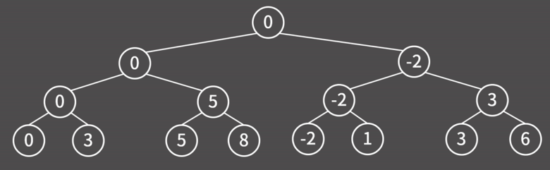

# [BOJ 1182 : 부분수열의 합](https://www.acmicpc.net/problem/1182)
- 랭크 : Silver 2
  <br><br>

### 문제 정리
- 부분 수열의 합을 구한다.
  <br><br>

### 문제 풀이
- 접근 1(Main)
    - 점점 사이즈가 커지는 조합을 통해 풀었다.

- 점근 2(MainRef)
    - 재귀 시, 현재 값을 더해줄지 / 말지를 각각 호출한 후 모든 값의 사용 여부가 체크되었으면 합과 결과를 비교한다.

````java
    private static void func(int cur, int tot) {
        if (cur == N) {
            if (tot == S) {
                result ++;
            }
            return;
        }

        func(cur + 1, tot);
        func(cur + 1, tot + arr[cur]);

    }
````
- 최초 호출은 func(0, 0)
- func(cur + 1, tot) -> 현재 arr[cur] 값은 더하지 않고, 다음 인덱스의 값으로 넘어간다.
- func(cur + 1, tot + arr[cur]) -> 현재 arr[cur] 값을 더하고, 다음 인덱스의 값으로 넘어간다.
- {-2, 5, 3}일 경우, 다음과 같다.



부분 수열은 맨 왼쪽부터 다음과 같이 발생한다.
- {0}, {3}, {5}, {3, 5}, {-2}, {-2, 3}, {-2, 5}, {-2, 3, 5} 
- 노드의 맨 아래는 위 부분수열의 합이 된다.
