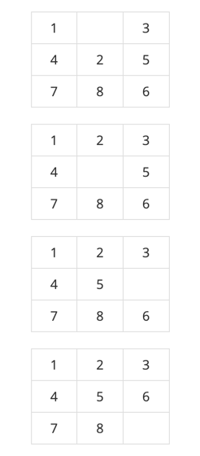

# [BOJ 1525 : 퍼즐](https://www.acmicpc.net/problem/1525)
- 랭크 : Gold 2
    
  
### 문제 정리
- 세 줄에 걸쳐서 표에 채워져 있는 아홉 개의 수가 주어진다. 한 줄에 세 개의 수가 주어지며, 빈 칸은 0으로 나타낸다.
- 첫째 줄에 최소의 이동 횟수를 출력한다. 이동이 불가능한 경우 -1을 출력한다.
    

     

### 문제 풀이
- 접근 (Main)
  - BFS로 접근한다. 0의 위치(zeroX, zeroY)와 현재의 모양(int[][] map)을 저장하는 Position 클래스를 만든다.
     1. Position을 Queue에서 꺼낸다.
     2. 정답 template과 비교한다. 일치하면 횟수를 출력하고 종료한다. 
     3. 일치하지 않는다면, 0의 위치에서 변경할 수 있는 위치를 찾는다.
     4. 해당 위치와 변경 후, 그 배열을 직렬화 하여 기존에 탐색한 모양인지 확인한다.
     5. 처음 본 모양이라면 queue에 넣는다.
     6. 큐가 비었음에도 찾지 못했다면 -1을 반환한다.
    

    
    

