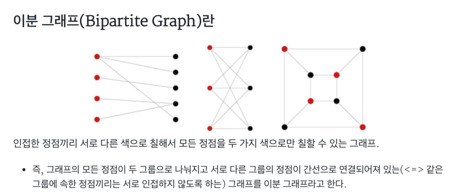

# [BOJ 1707 : 이분 그래프](https://www.acmicpc.net/problem/1707)
- 랭크 : Gold 4
    
  
### 문제 정리
- 그래프의 정점의 집합을 둘로 분할하여, 각 집합에 속한 정점끼리는 서로 인접하지 않도록 분할할 수 있을 때, 그러한 그래프를 특별히 이분 그래프 (Bipartite Graph) 라 부른다.
그래프가 입력으로 주어졌을 때, 이 그래프가 이분 그래프인지 아닌지 판별하는 프로그램을 작성하시오.
    
- 이분 그래프는 아래와 같이 인접한 정점끼리는 서로 다른 색이어야 한다. 또한 비연결그래프(모든 노드가 연결된 그래프가 아닌 그래프)일 경우 별도로 처리가 필요하다. 
  
    

### 문제 풀이
- 접근 (Main) 
   - BFS로 접근했다. 
    1. 1부터 모든 노드를 탐색한다. 이 때 처음 노드를 1로 저장해둔다.
    2. BFS를 통해 새로 발견된 노드에 대해서 -(현재 노드) 값을 저장한다. 이렇게 하면 BFS에서 매 깊이마다 앞 부모 노드와 다른 값을 할당 받는다. 
       - Ex) 1(+1) -> 4(-1) -> 5(+1) -> 6(-1)
    3. 새로운 노드가 아닐 경우, 현재 노드(BFS 부모)와 탐색 노드(부모의 ArrayList에서 뽑은 노드)의 값을 비교한다. 같다면 이분 그래프가 아니므로 전역 boolean 값을 false로 반환한다.
    4. 비연결 그래프일 경우를 대비해서, 모든 노드에 대해서 1 ~ 3을 진행한다. 한번이라도 false가 할당되면 이분 그래프가 아니므로 NO를 append 한다.
       - 비연결일 경우, 앞서 탐색한 그래프들과 독립적으로 탐색하면 된다. 예를 들어 그래프 집합이 2개일 경우, 각 집합이 이분 그래프라면 전체 그래프 집합으로 비교해도 이분 그래프에 해당한다.
       - 각각이 -1, 1로 나눠지고 서로 그래프 집합 간 연결이 없으므로 독립적으로 검사하면 된다.
    5. 주의할 점으로는, 테스트 케이스 마다의 종속성을 없애기 위해 static 변수를 초기화 해야한다. 

    
    

