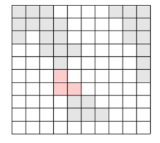

# [BOJ 2146 : 다리 만들기](https://www.acmicpc.net/problem/2146)
- 랭크 : Gold 3
    
  
### 문제 정리
- 이 바다에 가장 짧은 다리를 놓아 두 대륙을 연결하고자 한다. 가장 짧은 다리란, 다리가 격자에서 차지하는 칸의 수가 가장 작은 다리를 말한다. 다음 그림에서 두 대륙을 연결하는 다리를 볼 수 있다.
- 지도가 주어질 때 가장 짧은 다리 하나를 놓아 두 대륙을 연결하는 방법을 찾이라.

     

### 문제 풀이
- 접근 (Main)
  - 모든 대륙이 1로 표현되기 때문에 자신과 구분을 할 필요가 있다. labeling 메서드를 통해 대륙에 숫자로 이름을 붙인다. 이 때 BFS를 사용한다.
  - 그 후, 모든 섬에 대해서만 BFS를 수행한다. 이 때 자신과 같은 대륙이거나, 탐색한 바다일 경우에는 pass한다.
  - 중요한 건, 바다(0) 또는 다른 대륙일 경우에만 queue에 넣으며, queue에서 poll한 노드가 다른 대륙이라면 depth를 갱신한다.
  - 어떤 노드에 대해서는 다른 대륙으로 인한 return depth가 아닌, queue가 비어서 BFS가 종료되는 경우가 생긴다.
  이 때는 탐색 depth를 무시해야 하므로, -1을 반환해야 한다. 이 부분에 주의한다.
    
    

    
    

