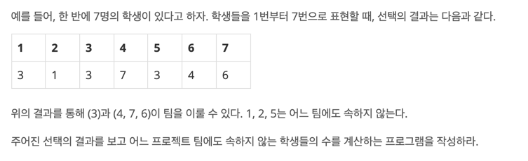

# [BOJ 9466 : 텀 프로젝트](https://www.acmicpc.net/problem/9466)
- 랭크 : Gold 3
    
  
### 문제 정리

     

### 문제 풀이
- 접근 1. (Main)
  - DFS 혹은 BFS + ArrayList를 이용해서 여러 조건에 맞게 count를 계산했다.
  - 시간 초과
    
- 접근 2. (MainRef)
  - boolean[]을 2개 사용했다. 하나는 순수 방문용이고, 하나는 해당 노드에서 사이클 형성 여부를 확인하기 위한 배열이다.
  1. 해당 노드를 방문하지 않았을 경우, DFS로 재귀를 진행한다.
  2. 해당 노드를 방문했었을 경우, 해당 노드에서 사이클 형성 여부도 확인한다. 사이클 형성이 없었을 경우, 연결된 노드를 돌며 팀에 포함되는 학생 수를 count 한다.
  3. 사이클을 확인했으면 finished[]를 true로 변경해서, 해당 사이클이 이미 탐색되었음을 알린다.
     1. 4로 시작을 가정한다. 만약 4 -> 7 -> 6 -> 4에서 4의 사이클이 검사되었으면 true로 변경한다. 이 때 검사된 노드를 count한다. (+3)
     2. 6의 검사 시점에는 6 -> 4 -> 7 -> 6에서 6과 연결된 4의 사이클이 1에서 검사되었음을 확인했다. 따라서 6의 사이클도 true로 변경한다.
     3. 7의 검사 시점에는 7 -> 6 -> 4 -> 7에서 7과 연결된 6의 사이클이 2.에서 검사되었음을 확인했다. 따라서 7의 사이클을 true로 변경한다.
     4. 따라서 4의 사이클만 검사하면 나머지는 반복문을 돌 필요가 없다.
    

    
    

