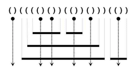

# [BOJ 10799 : 쇠막대기](https://www.acmicpc.net/problem/10799)
- 랭크 : 실버3
    
  
### 문제 정리
- 한 줄에 쇠막대기와 레이저의 배치를 나타내는 괄호 표현이 공백없이 주어진다. 괄호 문자의 개수는 최대 100,000이다.
- 레이저로 인해 분리되는 쇠막대기의 수를 계산한다.

    

### 문제 풀이
- 접근 1. (Main) : Stack으로 접근했다.
- 접근 2. (MainNoStack) : stack 없이 charArray 내에서 해결했다.  

    
    

    
    

