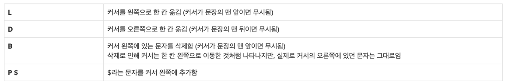

# [BOJ 1406 : 에디터](https://www.acmicpc.net/problem/1406)
- 랭크 : Silver 3
    
  
### 문제 정리

- 첫째 줄에는 초기에 편집기에 입력되어 있는 문자열이 주어진다. 
- 이 문자열은 길이가 N이고, 영어 소문자로만 이루어져 있으며, 길이는 100,000을 넘지 않는다. 둘째 줄에는 입력할 명령어의 개수를 나타내는 정수 M(1 ≤ M ≤ 500,000)이 주어진다. 셋째 줄부터 M개의 줄에 걸쳐 입력할 명령어가 순서대로 주어진다. 명령어는 위의 네 가지 중 하나의 형태로만 주어진다.
- 첫째 줄에 모든 명령어를 수행하고 난 후 편집기에 입력되어 있는 문자열을 출력한다.
     

### 문제 풀이
- 접근 : Deque 2개(또는 Deque 1개, Queue 1개)로 해결할 수 있다.
    

    
    

