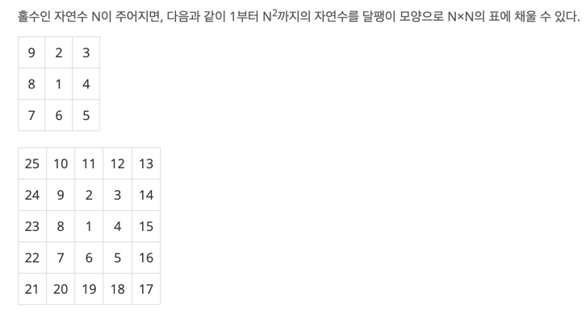

# [BOJ 1913 : 달팽이](https://www.acmicpc.net/problem/1913)
- 랭크 : Silver 5
    
  
### 문제 정리
- 다음 그림으로 설명된다. 그림과 같이 출력하면 된다.

  

### 문제 풀이
- 접근 (Main) 
   - 맨 첫번째 0, 0을 x, y로 잡고 시작한다.
   - 아래 / 오른쪽 / 위 / 왼쪽 방향으로 이동하면서 값을 할당한다.
   - 이 때, 범위를 고려해서 이전 값을 덮어씌우지 않도록 한다.
   - 예를 들어, 25 ~ 21까지 할당했으면 20은 다음 column으로 지정해야 한다.
   - 한바퀴를 돌은 후, x, y를 1씩 증가시킨 후 반복한다.
   - Stringbuilder로 한꺼번에 출력해야 시간이 확 줄어든다.
  

  

    
    

    
    

