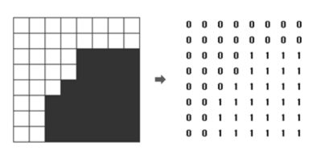

# [BOJ 1992 : 쿼드트리](https://www.acmicpc.net/problem/1992)
- 랭크 : Silver 1
    
  
### 문제 정리
  
- 위 그림에서 왼쪽의 영상은 오른쪽의 배열과 같이 숫자로 주어지며, 이 영상을 쿼드 트리 구조를 이용하여 압축하면 "(0(0011)(0(0111)01)1)"로 표현된다.  N ×N 크기의 영상이 주어질 때, 이 영상을 압축한 결과를 출력하는 프로그램을 작성하시오.

  

### 문제 풀이
- 접근 (Main) 
  - 앞서 푼 1780 - 종이의 개수와 동일한 문제이다. 앞서 1780이 /3이었다면 /2로 진행하면 된다.
  - 다만, 괄호에 유의한다. 재귀 for문 그룹에 들어가기 전과 후에 각각 괄호를 열고 닫으면 된다.
  
  

  

    
    

    
    

