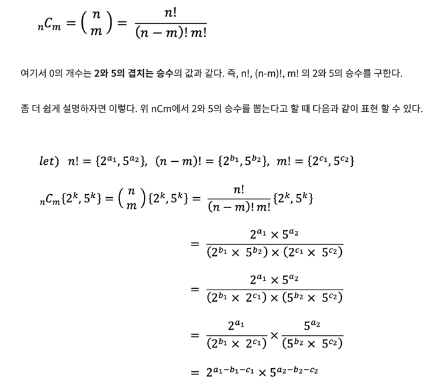

# [BOJ 2004 : 조합 0의 개수](https://www.acmicpc.net/problem/2004)
- 랭크 : Silver 2
    
  
### 문제 정리
- nCm의 끝자리 0의 개수를 출력한다.
  

### 문제 풀이
- 접근 (Main) 
  - 앞서 사용한 팩토리얼 0의 개수 방법을 사용한다. 
  - 앞에서 5, 25, 125.. 식으로 접근했지만 결론은 해당 수를 인수분해 했을 때 5의 승수가 0의 개수와 동일하다.
  - 또한 다음 방법을 이용한다.
  - 아래에서, 2의 승수인 a1-b1-c1과 5의 승수인 a2-b2-c2 중 작은 수가 0의 개수가 된다. 둘이 곱해져 10이 나와야 뒷자리가 0으로 끝나기 때문이다. 작은 수의 승수 만큼 0이 생기게 된다.
  - [참고](https://st-lab.tistory.com/166)
  
    

  

    
    

    
    

