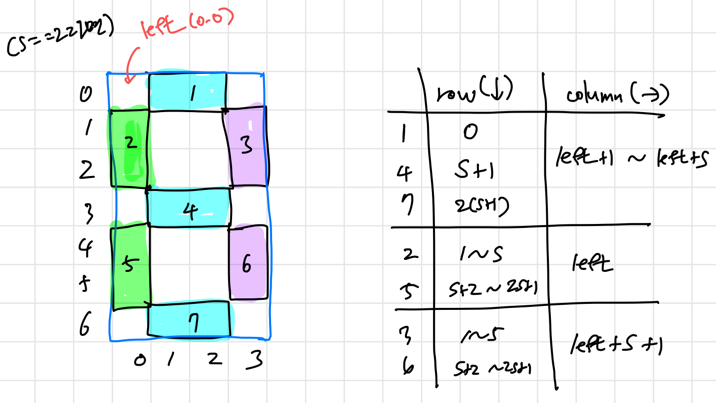

# [BOJ 2290 : LCD Test](https://www.acmicpc.net/problem/2290)
- 랭크 : Silver 2
    
  
### 문제 정리
- 길이가 s인 '-'와 '|'를 이용해서 출력해야 한다. 각 숫자는 모두 s+2의 가로와 2s+3의 세로로 이루어 진다. 나머지는 공백으로 채워야 한다. 각 숫자의 사이에는 공백이 한 칸 있어야 한다.
    

### 문제 풀이
- 접근 (Main) 
   - 7개의 segment로 이루어진 각 부분을 나누고, 모든 숫자마다 포함 여부를 check하는 2차원 배열을 만든다.
   - 각 segment 부분마다 범위를 정하고, 해당 segment를 포함하면 그 범위에 맞게 '-' 또는 '|'를 추가하는 메서드를 호출한다.
   - 다음 블로그를 참고했다. (https://melthleeth.tistory.com/entry/%EB%B0%B1%EC%A4%80-2290-LCDTest-Java)

  
  
  

    
    

    
    

