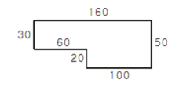

# [BOJ 2477 : 참외밭](https://www.acmicpc.net/problem/2477)
- 랭크 : Silver 4
    
  
### 문제 정리
- 입력으로 주어진 밭에서 자라는 참외의 수를 출력한다.
- 참외밭의 면적을 구하는게 관건이다.
  

### 문제 풀이

- 접근 (Main) 
   - 가로, 세로 각각 장변이 존재한다. 이는 전체 사각형 넓이가 된다.
   - 장변에서 다른방향의 장변이 아닌쪽(예를 들면 160에서, 50이 아닌 30쪽) 다음(30) 다음(60)부터가 빼야 할 변의 길이가 된다.
      - 둘레가 순서대로 입력되므로, 다음과 같이 처리한다. 큐를 사용했다.
         1. 해당 변이 장변이 아닐 경우, 큐에 다시 넣는다.
         2. 해당 변이 장변일 경우, 다음 변도 장변인지 확인한다. 다음 변도 장변이라면, poll을 2번 수행해서 단변을 얻는다.
         3. 다음 변이 장변이 아닐 경우, 그 다음 poll부터가 단변이다. 
  
- 팁 (참고 : https://mygumi.tistory.com/278) 
   - 배열이 0, 1, 2, 3, 4, 5가 있다고 가정하자. 만약 5에서 앞과 뒤의 수를 알고 싶다면 분기 말고 다음처럼 작성한다.
      - 분기 사용 시 : if(i == 5) { 어쩌고 저쩌고 }
      - 한꺼번에 처리 가능 (범위 넘어가는 수도 가능) 
          - arr[(i+5) % 6] -> 바로 뒷자리(i == 5일 경우 4를 가리킴)
          - arr[(i+1) % 6] -> 그 다음 자리(i == 5일 경우 0을 가리킴)
          - arr[(i+L-1) % L]을 잘 활용해보자.

    
    

    
    

