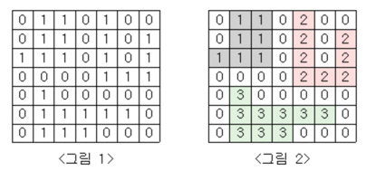

# [BOJ 2667 : 단지 번호 붙이기](https://www.acmicpc.net/problem/2667)
- 랭크 : 실버1
    
  
### 문제 정리
1. 지도를 입력하여 단지수를 출력하고, 각 단지에 속하는 집의 수를 오름차순으로 정렬하여 출력하는 프로그램을 작성하시오.
아래 예시는 단지 3개이고, 오름차순으로 7, 8, 9를 출력하면 된다.   

     

### 문제 풀이
- 접근 : 1 -> 0으로 바꾸고 BFS를 돌리며 1->0으로 변경하는 수를 count한다. 결과를 List에 집어 넣는다.
마지막으로 list의 size 및 오름차순 정렬된 list를 출력한다. 
  

  

    
    

    
    

