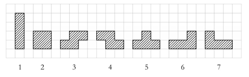

# [BOJ 3019 : 테트리스](https://www.acmicpc.net/problem/3019)
- 랭크 : 실버 2
    
  
### 문제 정리
- 테트리스는 C열 필드위에서 플레이하는 유명한 게임이다. 필드의 행의 수는 무한하다. 한 번 움직일 때, 아래와 같은 일곱가지 블록 중 하나를 필드에 떨어뜨릴 수 있다.

- 테트리스 아래쪽에 오는 부분에 빈곳이 없도록 테트리스를 놓을 수 있는 경우의 수를 찾아라.  

     

### 문제 풀이
- 접근 (Main)
   - 테트리스의 아래 부분만 고려하면 된다. 각각 case별로 땅으로부터 떨어져 있는 거리를 구한다.
      - 예를 들어 위의 그림에서 3은 '001', 4는 '100' 등으로 표현할 수 있다.
   - 입력된 필드를 String으로 받는다. 테트리스의 아랫변 길이만큼만 검사를 진행한다.
      - 예를 들어 3번 블록은 테트리스 아랫변 길이가 3이므로, String에서 왼쪽부터 3개만 검사한다.
      - 주어진 칸의 높이에서 가장 낮은 값을 구하고, 범위 내에서 차이를 통해 굴곡을 구한다.
      - 예를 들어 높이가 4 2 3이면 -> 가장 낮은 높이는 2이므로, 굴곡은 2 0 1이 된다.
      - 이를 기반으로 떨어지는 테트리스 블록과 일치하는지 여부를 확인한 후, 일치하면 result를 올리면 된다.
    
    
    

  

    
    

    
    

