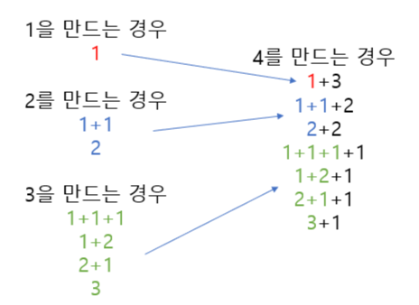

# [BOJ 9095 : 1, 2, 3 더하기](https://www.acmicpc.net/problem/9095)
- 랭크 : Silver 3
    
  
### 문제 정리
- 정수 n이 주어졌을 때, n을 1, 2, 3의 합으로 나타내는 방법의 수를 구하는 프로그램을 작성하시오.

     

### 문제 풀이
- 접근 (Main) 
  - 1, 2, 3의 경우를 미리 만둘어 둔다.
  - 4는 다음과 같이 구성된다.
     - 1 만드는 경우 + 3(을 붙임) -> 1개
     - 2 만드는 경우 + 2(를 붙임) -> 2개
     - 3 만드는 경우 + 1(을 붙임) -> 4개
     - 1 + 2 + 4 = 7개
  - 점화식은 d(n) = d(n-1) + d(n-2) + d(n-3)

    
#### 참고 블로그 : https://velog.io/@jkh9615/%EC%95%8C%EA%B3%A0%EB%A6%AC%EC%A6%98-%EB%B0%B1%EC%A4%80-9095-1-2-3-%EB%8D%94%ED%95%98%EA%B8%B0-Java
    

    
    

